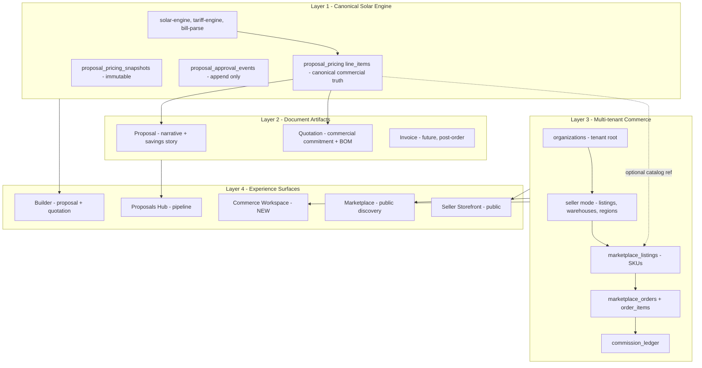
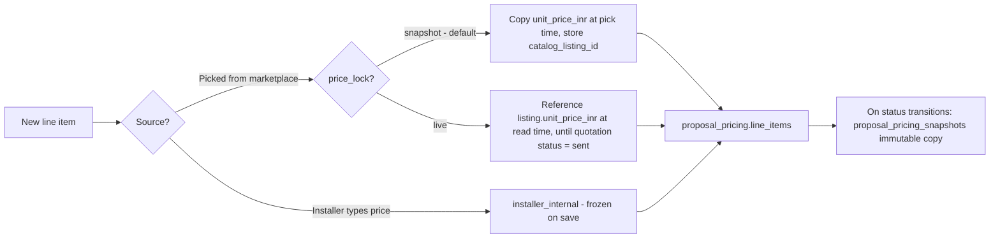
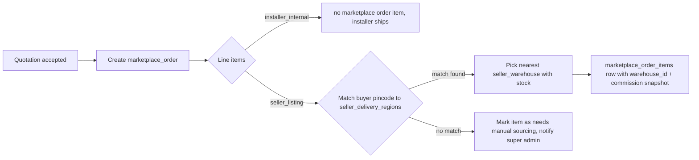
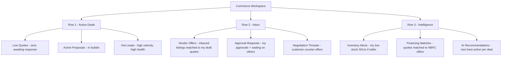
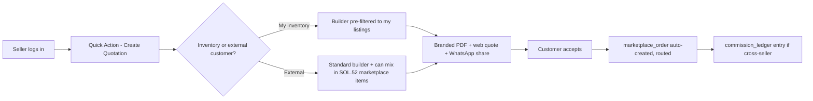
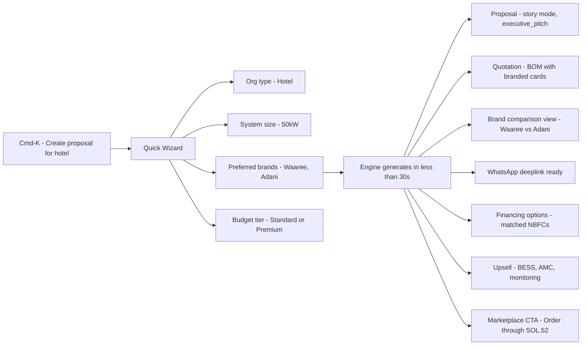

# SOL.52 — Solar Commerce + Proposal Network Architecture

> Companion to the prior **Instant Proposal + Quotation Architecture** plan. That plan defines *how a single org sells*. This plan defines *how many orgs sell together* on one platform — sellers, listings, inventory, commissions, fulfillment, and the Commerce Workspace.

---

## STATUS: DEFERRED INFRASTRUCTURE — DO NOT IMPLEMENT YET

**Decision (2026-05-19):** This entire blueprint is **frozen as deferred infrastructure**. No phase below (E1–E7) is to be implemented in the current cycle.

**Unlock condition — implementation may begin only when ALL of the following are true:**

1. The Proposal OS has reached **production-quality maturity** — Phase D (Instant Proposal + Quotation) is fully shipped, the unified builder is stable on mobile + desktop, the canonical engine has zero open correctness bugs, and `proposal_pricing_snapshots` + `proposal_approval_events` audit flows are battle-tested with real customer data.
2. The current Proposal OS roadmap (E0–E13 from the prior Experience Blueprint, plus Phase D from the [Instant Proposal + Quotation Architecture plan](instant_proposal_+_quotation_architecture_b4259dbd)) is signed off as "done" by the product owner.
3. A go/no-go review explicitly references this document and re-confirms the architecture is still correct for the market reality at that future date.

**Current priority — Proposal OS perfection.** All design, engineering, and QA effort flows to the proposal engine, builder UX, residential/commercial parity, story modes, share flows, and intelligence (org-type defaults, AI quick suggestions). Marketplace, vendor onboarding, listings, orders, commissions, and Commerce Workspace are **out of scope** until the unlock condition is met.

**What this document is for, in the meantime:**
- A **preservation contract** — every choice below (single-tenant root, additive pricing-line fields, snapshot-on-send, append-only commission ledger, organization-mode flags, layered architecture) is the agreed long-term shape. Day-to-day Proposal OS work must remain *compatible* with it (no destructive moves that would block these phases later), but must not *anticipate* it with premature scaffolding.
- A **reference for safe seams** — when Proposal OS work touches `organizations`, `proposal_pricing.line_items`, `proposal_pricing_snapshots`, or `proposal_approval_events`, contributors should keep this document open to ensure additive-only changes (per MASTERPLAN §5.2).
- A **resumable plan** — the phase breakdown (§13), data model (§3), and risks (§14) can be picked up unchanged once the unlock condition is met.

**Explicit do-NOT list while deferred:**
- Do **not** create `seller_*`, `marketplace_*`, `commission_*` tables or migrations.
- Do **not** add `source_kind` / `catalog_listing_id` / `seller_org_id` / `price_lock` fields to the pricing-line Zod schema yet.
- Do **not** scaffold `/commerce`, `/marketplace`, or `/seller/[slug]` routes.
- Do **not** add seller-mode toggles to `organizations` migrations.
- Do **not** introduce a new top-level nav entry for "Commerce" in [`components/shell/nav-rail.tsx`](components/shell/nav-rail.tsx) or [`components/shell/top-bar.tsx`](components/shell/top-bar.tsx).
- Do **not** wire the command palette to marketplace actions.

If a Proposal OS task ever appears to *require* one of the above, stop and re-open this document for a deliberate unlock review — do not bypass.

---

## 0. North-star principle

> **One canonical engine. Many tenants. Layered surfaces.**

- The proposal/quotation engine (`proposal_pricing` + IR + preset/block registry) stays the single source of commercial truth — for SOL.52, for every vendor, for every storefront.
- Sellers (SOL.52 itself + 3rd-party vendors) are just **organizations with a seller mode enabled**. No parallel tenant model.
- Marketplace, vendor storefronts, commerce workspace are **read/write surfaces** over the same engine. They don't fork pricing.
- Customer-facing experience stays "Shopify-simple" — under-the-hood multi-tenancy is invisible.

This mandate is already locked in [`MASTERPLAN.md`](MASTERPLAN.md) §3 (rule 4), §4, §5 — this plan operationalizes it.

---

## 1. Architectural answer to Q7 (the most important question)

**Verdict: Layered modular system on a multi-tenant commerce substrate. Not a unified mega-engine. Not three separate silos.**

Four discrete layers, each replaceable without breaking the others:



**Why this shape:**

- **Unified engine (option A)** would force marketplace into proposal schema → bloated, slow, hard to evolve catalog independently.
- **Three silos (variant of B)** would re-implement pricing logic in catalog/orders → inconsistent totals, snapshot drift, the exact bug pattern we've fought historically.
- **Layered + multi-tenant (the chosen direction)** keeps the engine canonical (no silent forks), lets the commerce layer scale (catalog, inventory, commissions can change independently), and treats artifacts (proposal/quotation/invoice) as **views** over one priced BOM.

**Concrete rule that enforces it:** every line on every quotation, every order, every commission entry traces back to a `proposal_pricing.line_items` row (or a snapshot of one). No commerce surface inserts pricing directly.

---

## 2. Tenant model: one org, many modes

Today an `organizations` row = an installer company. Tomorrow it can wear up to four **modes** simultaneously, all controlled by additive flags. No parallel tenant types.

| Mode | Flag (additive column on `organizations`) | What it unlocks |
|---|---|---|
| **Installer** (default) | always on | CRM, proposals, projects |
| **Seller / Vendor** | `marketplace_seller_enabled boolean` | listings, warehouses, storefront, commissions |
| **Buyer** | `marketplace_buyer_enabled boolean` (default true) | purchase from marketplace |
| **Platform-owned (SOL.52 itself)** | `seller_kind enum('partner','platform_owned')` | special seller org owned by super admins |

**SOL.52 as seller (Q1):** a real `organizations` row with `seller_kind='platform_owned'`, owned and operated by super admins. Selling SOL.52-branded panels/inverters is just "this seller is a first-party". No special-casing in the engine.

**Customers stay simple:** end customers (hotel owners, homeowners) remain rows in `customers`/`leads` (not orgs). Only businesses that need to *sell* become orgs. This preserves the "low-tech sales person" flow.

---

## 3. Data model — additive migrations only

Building strictly on the foundation already shipped in [`supabase/migrations/020_organizations_foundation.sql`](supabase/migrations/020_organizations_foundation.sql). Every change is additive (no destructive rewrites, MASTERPLAN §5.2 rule).

### 3.1 Extend organizations (Phase E1)

```sql
ALTER TABLE organizations
  ADD COLUMN seller_kind text DEFAULT 'partner' CHECK (seller_kind IN ('partner','platform_owned')),
  ADD COLUMN marketplace_seller_enabled boolean DEFAULT false,
  ADD COLUMN marketplace_buyer_enabled boolean DEFAULT true,
  ADD COLUMN seller_verification_level text DEFAULT 'unverified'
    CHECK (seller_verification_level IN ('unverified','verified','trusted','sol52_verified')),
  ADD COLUMN gst_number text NULL,
  ADD COLUMN legal_name text NULL,
  ADD COLUMN logo_url text NULL,
  ADD COLUMN seller_slug text NULL UNIQUE;
```

### 3.2 Seller operating tables (Phase E2)

| Table | Purpose |
|---|---|
| `seller_warehouses` | `(id, org_id, name, address, pincode, lat, lng)` — per-seller stock locations |
| `seller_delivery_regions` | `(seller_org_id, state, pincode_prefix, lead_time_days, freight_inr)` — where they ship |
| `marketplace_listings` | `(id, seller_org_id, epc_category, brand, model, wattage, unit_kind, unit_price_inr, warranty_years, datasheet_url, status, moderation_state)` — the SKU |
| `seller_inventory` | `(listing_id, warehouse_id, stock_qty, low_stock_threshold, updated_at)` — daily-snapshot stock |
| `marketplace_bundles` | `(id, owner_org_id, name, listing_ids[], discount_pct, target_system_kw_min, target_system_kw_max)` — kits |

### 3.3 Commerce orchestration (Phase E3)

| Table | Purpose |
|---|---|
| `marketplace_inquiries` | proposal/quote → seller "interested" handshake, lives independently of orders |
| `marketplace_orders` | `(id, buyer_org_id NULL, buyer_lead_id NULL, status, source_proposal_id, source_quotation_id, total_inr, created_at)` |
| `marketplace_order_items` | `(order_id, listing_id, seller_org_id, warehouse_id, quantity, unit_price_inr_snapshot, commission_inr_snapshot)` |
| `commission_rules` | `(id, seller_org_id NULL, epc_category NULL, percentage, flat_fee_inr, effective_from)` — global defaults + per-seller overrides |
| `commission_ledger` | append-only entries per `marketplace_order_items` row, mirrors `proposal_approval_events` pattern |
| `platform_featured_sellers` | super-admin curated feature flags + boost score |
| `platform_recommendation_rules` | "if proposal has 5kW residential in Maharashtra, recommend Listing X" |

### 3.4 The single critical extension to the engine

The only change to existing canonical tables is **two nullable columns** on `proposal_pricing.line_items` (already pre-approved in MASTERPLAN §5.2):

```sql
-- inside the jsonb line_items shape (no SQL migration; schema-level Zod change)
{
  ...existing fields,
  source_kind?: "installer_internal" | "seller_listing",
  catalog_listing_id?: uuid | null,
  seller_org_id?: uuid | null,
  price_lock?: "snapshot" | "live"   // default "snapshot"
}
```

This is the **single seam** that lets the marketplace plug into the canonical engine. Old proposals/quotations keep working unchanged (every field is optional).

---

## 4. Pricing ownership — the rule that prevents chaos

Three explicit pricing sources, with **deterministic precedence**:



**Rules:**

- The moment a quotation is `sent`, even `live` lines auto-collapse to `snapshot` — the customer always sees a stable number.
- Each snapshot remains a row in `proposal_pricing_snapshots` (existing). Audit-grade.
- Approval events log the source change too: "line item X switched from installer_internal to seller_listing(Waaree 540W)".

This answers **pricing ownership + approval workflow** in one mechanism that already exists.

---

## 5. Order routing — keep it boringly simple



**No real-time stock juggling for MVP.** Daily inventory snapshot + low-stock threshold alerts. Real-time integration is a Phase E6+ concern.

---

## 6. Commission system — append-only, never silent

- Default rule: 5% on all marketplace order items (configurable per category by super admin).
- Per-seller overrides allowed (premium sellers may negotiate down).
- On every `marketplace_order_items` insert: snapshot the commission rule at that moment into the item row (`commission_inr_snapshot`), and append a `commission_ledger` entry.
- Ledger never updates — disputes generate new compensating entries (same pattern as `proposal_approval_events`). This is what auditors and CFOs need.

---

## 7. Role permissions — extends existing RBAC

Building on [`MASTERPLAN.md`](MASTERPLAN.md) §3 — three roles already defined: Super Admin / Company Admin / Employee. Add **scoped permissions** within each role; no new role types.

| Capability | Super Admin | Company Admin | Employee | Seller Admin* | Customer (read-only via share token) |
|---|---|---|---|---|---|
| Approve sellers globally | yes | no | no | no | no |
| Set global commission defaults | yes | no | no | no | no |
| Feature a seller | yes | no | no | no | no |
| Toggle own org's `marketplace_seller_enabled` | yes | yes | no | n/a | no |
| Create/edit own listings | yes | yes | per perm | yes | no |
| Manage own inventory | yes | yes | per perm | yes | no |
| Create proposal/quotation | yes | yes | yes | yes | no |
| Convert quote to marketplace order | yes | yes | per perm | yes | no |
| View own org's commission ledger | yes | yes | no | yes | no |
| View any org's data | yes | no | no | no | no |

*Seller Admin = a sub-permission set on an existing org member with `role='company_admin'` whose org has seller mode enabled. Not a new top-level role — just a permission expansion.

---

## 8. Solar Commerce Workspace (Q8) — the new module

A **new top-level surface** alongside Dashboard, Proposals, Customers, Projects. It's the "trading desk" view of the business.



**Composition rule:** every tile in Commerce Workspace is a **filter over existing data + new commerce tables**. No new "commerce" entities outside what §3 defines. This keeps the surface a *view*, not a silo.

**Mobile-first card stack:** on phone, three rows become a vertical stack with one card per screen; swipe between sections. Desktop = 3-column grid.

**Lives at** `/commerce` (new route). Hub at `/proposals` stays as-is (deal pipeline). They are siblings, not nested.

---

## 9. Seller storefront + marketplace surfaces (Q2, Q3, Q5)

Three public surfaces — all read-only Next.js routes, share-token pattern reused:

| Route | Purpose | Note |
|---|---|---|
| `/marketplace` | Public discovery — browse by category/region/brand, featured sellers ribbon | New |
| `/seller/[slug]` | Per-seller storefront — brand, listings, ratings, "Get quote" CTA | New, uses `organizations.seller_slug` |
| `/quote/[token]` | Existing pattern from prior plan — quotation public view | Extend to embed branded product cards when `source_kind = seller_listing` |
| `/proposal/[token]` | Existing public proposal view | Unchanged; commerce is *additive* |

**Seller-side flow (Q3) reuses existing engines end-to-end:**



No new builder. The same `/proposal` page + the Phase D `/quotation` builder — with a single new toggle: "Use my inventory only" / "Mix marketplace". Implementation = a `WHERE seller_org_id = me` filter on the catalog picker.

---

## 10. Customer experience — Q5 in one screen

The 30–60 second flow already specified in the prior plan extends with marketplace intelligence — same Cmd-K command palette, same prefill URL pattern:



The "intelligence" (financing match, upsell, brand comparison) is a **service layer** call (`lib/ai-quick-suggest.ts` from prior plan, extended) — not new entities. Output renders into existing proposal blocks via the block registry — no new render pipeline.

---

## 11. Simplicity manifesto (Q9) — non-negotiable rules

These become enforced UX laws in the design system:

1. **No screen with more than 5 required fields.** Always defaults from org type + region + brand prefs.
2. **WhatsApp is the primary delivery channel** for residential & small commercial. Email is secondary. PDF is on-demand.
3. **One word labels.** "Items" not "BOM". "Total" not "Net Cost". "Send" not "Dispatch". Hindi parity for every label via `useLanguage`.
4. **AI fills the unknown.** Every form field has an "I don't know" / "Suggest" affordance backed by `ai-quick-suggest`.
5. **Mobile is the design floor, not the ceiling.** Every new surface designs phone first, scales up.
6. **No nested modals.** Drawers and full-screen sheets only on mobile.
7. **Quick Actions reach everywhere.** Cmd-K from any screen creates anything.

These rules go into [`lib/design-system.ts`](lib/design-system.ts) as comments + a checklist in `docs/SIMPLICITY_LAWS.md` (new doc).

---

## 12. What evolves vs preserves (Q10)

### Preserve (do not touch)
- `solar-engine`, `tariff-engine`, `bill-parse` — calculation truth
- `proposal_pricing` line shape (only additive optional fields)
- `proposal_pricing_snapshots`, `proposal_approval_events` — audit pattern
- `WEB_RENDERER_REGISTRY`, [`lib/proposal-block-registry.ts`](lib/proposal-block-registry.ts), [`lib/proposal-preset-engine.ts`](lib/proposal-preset-engine.ts) — block IDs are stable
- Public share token model (`/proposal/[token]`)
- Residential vs commercial renderer split — existing `WebRenderer` + `CommercialProposalView`
- E1 design tokens + E2 OsShell + E3 Proposals Hub — just shipped, don't refactor

### Evolve additively
- `organizations` — add seller mode flags (§3.1)
- `proposal_pricing.line_items` Zod schema — add optional `source_kind`, `catalog_listing_id`, `seller_org_id`, `price_lock`
- Builder catalog picker (existing) — gains a "Marketplace" tab next to "My catalog"
- Command palette ([`components/shell/command-palette.tsx`](components/shell/command-palette.tsx)) — gains marketplace search + seller search
- OsShell breadcrumbs — gain "Seller > Listings" trail when in seller mode

### Become modular
- Commerce surfaces — new `app/(main)/commerce/*` and `app/marketplace/*` route groups, isolated from `proposal/*`
- Seller settings — new `app/(main)/settings/seller/*`

### Become AI-assisted
- Brand recommendation per region/org type
- Quotation drafting from voice/text prompt
- Upsell card on every accepted quote
- Inventory low-stock natural-language alerts ("Waaree 540W will run out in 6 days at current pace")

### Become marketplace-ready
- Every `epc-component-catalog` category already has `marketplaceReady` flag — listings table reads it as a constraint
- Every `proposal_pricing.line_items` row already supports `catalog_category` — bridge column to `marketplace_listings.epc_category`

### Newly workspace-driven
- "Active workspace" pill (E2) extends to active **commerce context** — current quote, current order, current listing draft
- Approval feed + commission feed appear inside Commerce Workspace, not buried in settings

---

## 13. Phase E roadmap (sequenced, additive, shippable)

> Phase D (Instant Proposal + Quotation) is the prerequisite — already planned, partly underway. Phase E begins after Phase D ships D0–D3.

| Phase | Scope | Ship-gate |
|---|---|---|
| **E1 — Seller foundation** | Org table flag migration + Seller settings page + super admin seller-approval queue | One installer org can flip seller mode on |
| **E2 — Listings + storefront** | `marketplace_listings` + `seller_warehouses` + `seller_delivery_regions` + `/seller/[slug]` public page + listing CRUD UI | A seller can publish a listing visible at `/seller/their-slug` |
| **E3 — Catalog plug-in to engine** | Add `source_kind` / `catalog_listing_id` to pricing-line Zod + Builder catalog picker "Marketplace" tab + snapshot logic | An installer's quotation can pull a marketplace listing as a line item with proper price snapshot |
| **E4 — Public marketplace + recommendations** | `/marketplace` discovery + `platform_featured_sellers` + `platform_recommendation_rules` + featured ribbon on builder | A buyer can browse, compare, and add to quote |
| **E5 — Orders + commissions** | `marketplace_orders` + `marketplace_order_items` + `commission_ledger` + accept→order flow + super admin commission console | Accepted quote auto-creates routed order with commission entry |
| **E6 — Commerce Workspace** | `/commerce` route + tiles (live quotes, vendor offers, inventory alerts, financing matches, AI recs) | Mobile + desktop dashboards live |
| **E7 — Inventory automation + verification badges** | Inventory snapshot jobs + low-stock alerts + SOL.52 Verified Vendor badge (`seller_verification_level`) on storefront + builder | Sellers get inventory pressure visibility; buyers see trust signals |

Each phase is independently shippable. No phase blocks a customer-visible feature for more than 2 weeks of work.

---

## 14. Risks & explicit non-goals

**Risks watched**
- Pricing drift between snapshot and live listings → mitigated by auto-collapse to snapshot on `sent` (§4)
- Commission disputes → mitigated by append-only ledger (§6)
- Seller spam → mitigated by super admin approval gate + verification levels (§7, E1)
- "ERP creep" — too many fields, too many screens → mitigated by simplicity manifesto (§11) enforced in code review

**Non-goals (deferred)**
- Payment processing / settlement — Phase F+
- Multi-currency — Phase F+
- Real-time stock sync with vendor ERPs — Phase F+
- Logistics integration (Delhivery/Shadowfax APIs) — Phase F+
- Buyer-side org accounts — Phase E8+ (customers stay as `leads`/`customers` for now)

---

## 15. Open questions to confirm before E1 begins

These will be raised when we move from plan to execution. No need to answer now:

1. Should SOL.52 platform-owned seller org be seeded as a real migration row, or created via super-admin UI in E1?
2. Default commission percentage at launch — 3%? 5%? Per-category split?
3. Verification badge tiers — keep 4 (unverified → sol52_verified) or simplify to 3?
4. `/marketplace` discovery — search-first (IndiaMART style) or curated-first (Shopify-collections style) at launch?
5. Cross-org employee invitations — out of scope for E1, or do we need read-only "customer" portal accounts before E5?