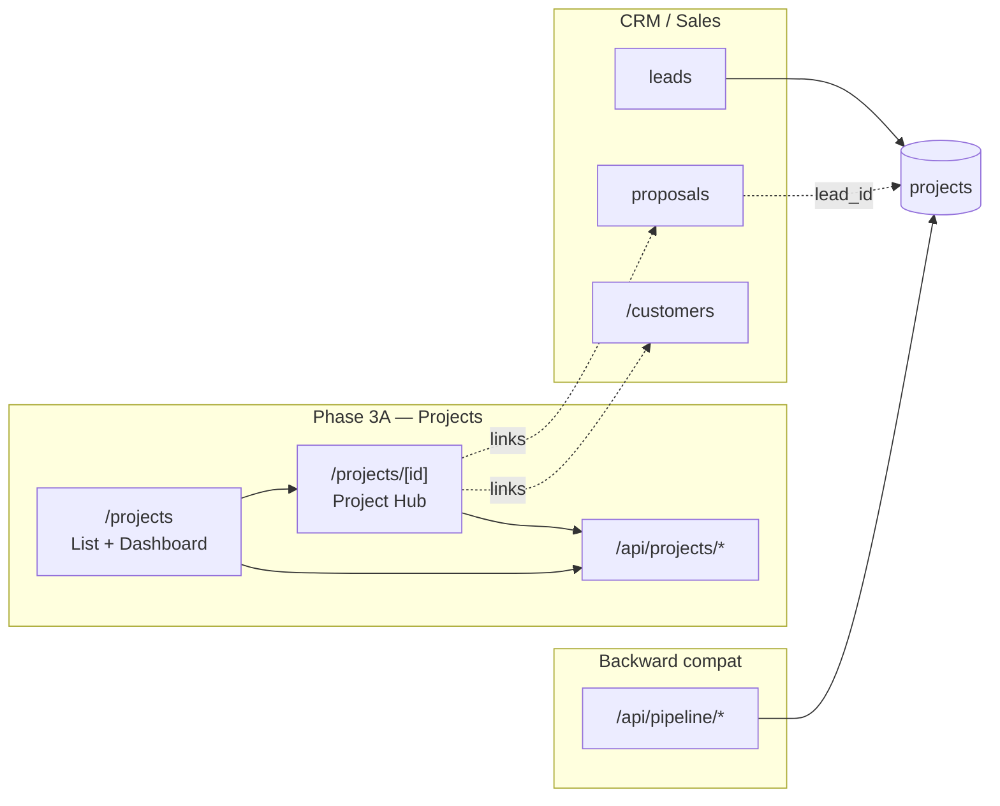
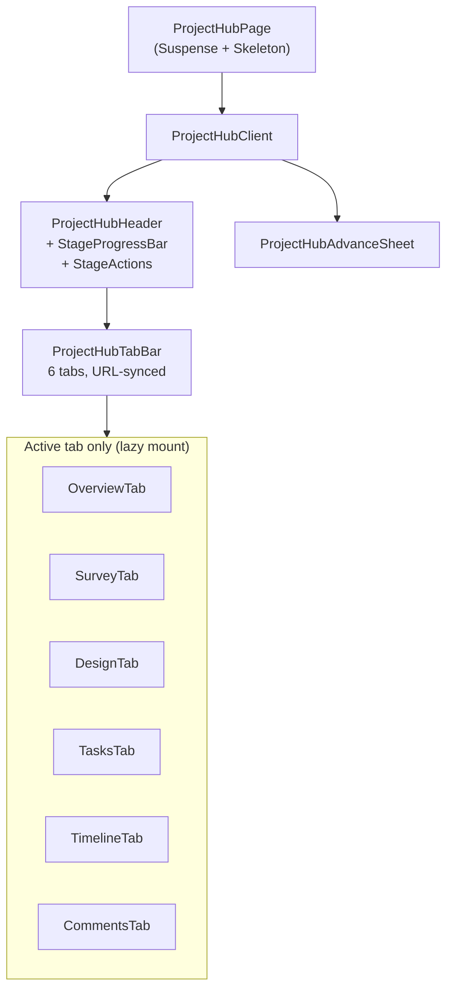

# Phase 3A — Complete Project Management Architecture

**Status:** Frozen (implementation complete through 3A-4)  
**Last updated:** 1 June 2026  
**Scope:** Solar EPC project lifecycle — database, APIs, list/dashboard UI, Project Hub  
**Related docs:** [Database ERD](./phase-3a-database-erd.md) · [Projects API](../api/phase-3a-projects-api.md) · [Project Hub detail](./phase-3a-4-project-hub.md)

---

## 1. Executive summary

Phase 3A delivers end-to-end **project management** for Sol.52 installer organizations:

| Sub-phase | Deliverable | Route / surface |
|-----------|-------------|-----------------|
| **3A-1** | Database + REST APIs | `supabase/migrations/036–045`, `/api/projects/*` |
| **3A-2** | Project list revamp | `/projects` — table, cards, filters, pagination |
| **3A-3** | Operations dashboard | `/projects` — stats, urgent list, payments due |
| **3A-4** | Project Hub | `/projects/[id]` — 6-tab operating screen |

All sub-phases use **existing Phase 3A-1 APIs only**. No new migrations were added in 3A-4. Development is **frozen** pending Phase 3A-5 planning.

---

## 2. System context



**Tenant boundary:** `organizations` is the sole tenant root. All Phase 3A tables include `organization_id`. Phase 3 uses service-role RLS policies; JWT-scoped policies are planned for Phase 5.

**Lead relationship:** Each project may link to one CRM lead via `projects.lead_id` (nullable, `ON DELETE SET NULL`). Legacy rows created via `/api/pipeline` always had a lead.

---

## 3. Lifecycle model

### 3.1 Six-stage pipeline

Projects progress through a **forward-only** stage sequence:

```
survey → design → approval → installation → net_metering → completed
```

Defined in `lib/project-stages.ts`. Stage advance is explicit via `POST /api/projects/[id]/advance-stage` — not inferred from legacy `status` or `install_progress`.

### 3.2 Stage status

Each stage has an execution status on `projects.stage_status`:

| Value | Meaning |
|-------|---------|
| `not_started` | Stage not yet begun |
| `in_progress` | Active work |
| `blocked` | Blocked (triggers health = blocked) |
| `done` | Stage work complete |

### 3.3 Net metering sub-status

When `current_stage = net_metering`, `projects.nm_substatus` tracks DISCOM workflow:

`not_started` → `application_filed` → `documents_submitted` → `inspection_pending` → `meter_installed` → `export_enabled`

Updated via `PATCH /api/projects/[id]`.

### 3.4 Health (computed, not stored)

Health is calculated at read-time in `lib/project-health.ts`:

1. **Blocked** — `stage_status = blocked`
2. **On track** — `current_stage = completed` or `actual_completion` set
3. **Delayed** — `target_completion` in the past and not completed
4. **Attention needed** — due within 7 days
5. **On track** — default

Returned on every list/detail response as `health`.

### 3.5 Tasks (advisory)

- Seeded from templates (`lib/project-task-templates.ts`) when a project enters a new stage.
- `is_blocking = true` shows a **warning** in the advance sheet but does **not** prevent stage advance in Phase 3.
- Custom tasks can be added via `POST .../tasks`.

---

## 4. Database layer

See **[phase-3a-database-erd.md](./phase-3a-database-erd.md)** for the full entity-relationship diagram.

### 4.1 Core tables (Phase 3A-1)

| Table | Purpose | Cardinality |
|-------|---------|-------------|
| `projects` | Master project record (legacy + Phase 3 columns) | 1 per installation job |
| `installer_profiles` | Org team members (roles + job functions) | N per org |
| `project_activity_log` | Unified lifecycle timeline | N per project |
| `project_site_surveys` | Field survey form | **1:1** per project |
| `project_designs` | Versioned system designs | **1:N** per project |
| `project_tasks` | Stage checklists | N per project |
| `project_comments` | Internal team notes | N per project |
| `notifications` | Operational alerts (schema only in 3A) | N per org |

### 4.2 Migration index

| Migration | Content |
|-----------|---------|
| `004_projects_pipeline.sql` | Original `projects` table + lead FK |
| `012_crm_v2.sql` | `dashboard_visible`, `archived_at` |
| `015_projects_add_lead_id_fk_set_null.sql` | Nullable lead_id |
| `020_organizations_foundation.sql` | `organization_id` on projects |
| `036_projects_phase3_core.sql` | Stage columns, `installer_profiles`, `project_activity_log` |
| `037_project_site_surveys.sql` | Survey table |
| `038_project_designs.sql` | Design versions |
| `039_project_tasks.sql` | Task checklists |
| `045_project_comments_notifications.sql` | Comments + notifications |
| `046_projects_legacy_pipeline_columns.sql` | Legacy column backfill |

### 4.3 Planned tables (not yet migrated)

Referenced in migration comments for future phases:

- `project_documents` — file cabinet (photos, SLD, bills)
- `project_payment_milestones` — milestone payments
- `project_subsidies` — subsidy workflow detail

---

## 5. API layer

All Phase 3A project routes live under `/api/projects/*`. Full reference: **[phase-3a-projects-api.md](../api/phase-3a-projects-api.md)**.

### 5.1 Response envelope

Every route returns JSON:

```json
{ "ok": true, "data": { ... } }
{ "ok": false, "error": "error_code" }
```

Client types and fetch wrappers: `lib/project-api-client.ts`.

### 5.2 Route map

| Method | Route | Purpose |
|--------|-------|---------|
| GET | `/api/projects/list` | Paginated project list |
| GET | `/api/projects/dashboard-stats` | Operations dashboard aggregates |
| POST | `/api/projects` | Create project (Phase 3) |
| GET | `/api/projects/[id]` | Project detail + joins + health |
| PATCH | `/api/projects/[id]` | Update project fields |
| POST | `/api/projects/[id]/advance-stage` | Forward stage advance |
| GET/POST/PATCH | `/api/projects/[id]/survey` | Site survey CRUD |
| GET/POST | `/api/projects/[id]/designs` | Design version list / create |
| GET/POST | `/api/projects/[id]/tasks` | Task list / create custom |
| PATCH | `/api/projects/[id]/tasks/[taskId]` | Update task |
| GET | `/api/projects/[id]/activity` | Activity timeline (paginated) |
| GET/POST | `/api/projects/[id]/comments` | Comments list / create |
| PATCH | `/api/projects/[id]/comments/[commentId]` | Pin/unpin comment |
| GET | `/api/notifications/unread-count` | Org unread badge count |

**Legacy (unchanged):** `/api/pipeline` and `/api/pipeline/[id]` continue to serve list edit/delete modal flows.

### 5.3 Server-side modules

| Module | Role |
|--------|------|
| `lib/project-store.ts` | Supabase queries, joins, adaptive schema inserts |
| `lib/project-activity-logger.ts` | Structured activity event writes |
| `lib/project-stages.ts` | Stage order, labels, validation |
| `lib/project-task-templates.ts` | Default tasks per stage |
| `lib/project-health.ts` | Health calculation |
| `lib/project-list-utils.ts` | List URL building, display names, sorting |
| `lib/project-hub-cache.ts` | SWR revalidation after hub mutations |

---

## 6. Frontend architecture

### 6.1 Project list & dashboard (3A-2 / 3A-3)

**Route:** `app/(main)/projects/page.tsx`

| Component area | Key files |
|----------------|-----------|
| List table / cards | `components/projects/project-list-*.tsx` |
| Filters & pagination | `project-list-filters.tsx`, `project-list-pagination.tsx` |
| Operations dashboard | `project-ops-*.tsx`, dashboard stats SWR |
| Deep links to hub | Row/card links → `/projects/[id]` |

**Views:** `active` (default), `hidden` (`dashboard_visible = false`), `archived` (`archived_at` set).

### 6.2 Project Hub (3A-4)

**Route:** `app/(main)/projects/[id]/page.tsx` → `ProjectHubClient`



**Tab deep links:** `/projects/[id]?tab=survey|design|tasks|timeline|comments` (overview = no query).

### 6.3 Data fetching (SWR)

| Layer | Strategy |
|-------|----------|
| Root | `GET /api/projects/[id]` — always on hub mount |
| Tabs | Lazy SWR — fetch only when tab is active |
| Cache keys | Exported from `lib/project-api-client.ts` |
| Mutations | `revalidateProjectHubCaches(projectId)` invalidates detail, all tab keys, list URLs, dashboard stats |
| Deduping | `dedupingInterval: 5000`, `revalidateOnFocus: false` on hub root |

### 6.4 Shell integration

- Hub sets `ShellContext.activeWorkspace` with project display name → breadcrumb shows project name instead of "Details".
- `WorkspacePage tone="projects"` + stagger animations.
- Mobile: 3×2 tab grid (no page-level horizontal scroll).

---

## 7. Activity logging

All significant mutations write to `project_activity_log` via `lib/project-activity-logger.ts`.

| Event type | Trigger |
|------------|---------|
| `project_created` | POST `/api/projects` |
| `stage_changed` | POST `advance-stage` |
| `nm_substatus_changed` | PATCH project `nm_substatus` |
| `survey_submitted` | POST/PATCH survey |
| `design_created` | POST design version |
| `task_completed` | PATCH task → `done` |
| `comment_added` | POST comment |
| `project_archived` | PATCH `archived_at` |

Timeline tab reads via `GET .../activity?limit=&before=` (newest first, cursor pagination).

---

## 8. Backward compatibility

| Legacy surface | Phase 3A behavior |
|----------------|-------------------|
| `/api/pipeline` POST | Still creates projects from won leads |
| `/api/pipeline/[id]` PATCH/DELETE | List modal edit/delete unchanged |
| `projects.status`, `install_progress`, `next_action` | Preserved; dashboard may still reference |
| `projects.customer_name`, `solar_kw` | Adaptive insert in `project-store` for mixed schemas |
| CRM `/customers/[id]` | Hub links out; does not embed CRM |
| Proposals `/proposal`, `/proposals` | Hub links via `lead_id`; no BOM editor in hub |

---

## 9. Explicitly deferred (Phase 3A-5+)

Documented placeholders — **not implemented** in 3A-4:

| Module | Planned capability | Current v1 |
|--------|-------------------|------------|
| **Documents** | Project file cabinet (photos, bills, NM docs) | CRM file link only |
| **Financial** | Milestones, material/install costs, subsidy workflow | Overview summary fields only |
| **Team assignment** | Role matrix (surveyor, designer, crew) | Read-only manager/tech |
| **Survey/Design write in hub** | In-hub forms | Read-only tabs (APIs exist) |
| **Notifications center** | Full inbox UI | Unread count badge only |
| **User name resolution** | Display names for assignees/authors | Truncated UUID display |
| **Kanban view** | Board layout | Out of scope |

---

## 10. Verification & quality

| Artifact | Location |
|----------|----------|
| Step 2–9 screenshot scripts | `scripts/verify-phase3a4-step*.mjs` |
| Step 10 full QA script | `scripts/verify-phase3a4-step10-screenshots.mjs` |
| Screenshot output | `scripts/phase3a4-step*-screenshots/` |
| Production readiness | **92/100** — GO (signed off 1 Jun 2026) |

---

## 11. File index (implementation)

### Routes
- `app/(main)/projects/page.tsx` — List + dashboard
- `app/(main)/projects/[id]/page.tsx` — Hub shell

### Hub components
- `components/projects/hub/project-hub-client.tsx` — Orchestrator
- `components/projects/hub/project-hub-header.tsx`
- `components/projects/hub/project-hub-tab-bar.tsx`
- `components/projects/hub/project-hub-overview-tab.tsx`
- `components/projects/hub/project-hub-survey-tab.tsx`
- `components/projects/hub/project-hub-design-tab.tsx`
- `components/projects/hub/project-hub-tasks-tab.tsx`
- `components/projects/hub/project-hub-timeline-tab.tsx`
- `components/projects/hub/project-hub-comments-tab.tsx`
- `components/projects/hub/project-hub-advance-sheet.tsx`
- `components/projects/hub/project-hub-stage-actions.tsx`
- `components/projects/hub/project-stage-progress-bar.tsx`
- `components/projects/hub/project-hub-skeleton.tsx`

### API routes
- `app/api/projects/` — All project endpoints (see §5.2)
- `app/api/notifications/unread-count/route.ts`

---

## 12. Phase freeze notice

**Development on Phase 3A is frozen** as of 1 June 2026. No further code changes until Phase 3A-5 is planned and approved. This document is the architecture source of truth for the delivered system.

**Next:** Phase 3A-5 planning (Hub v2 writes, user names, Documents, Financial, Team, CI smoke tests).
