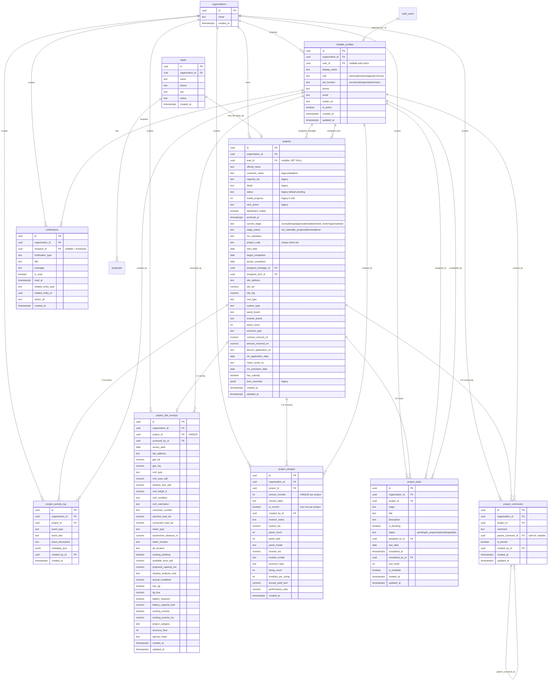
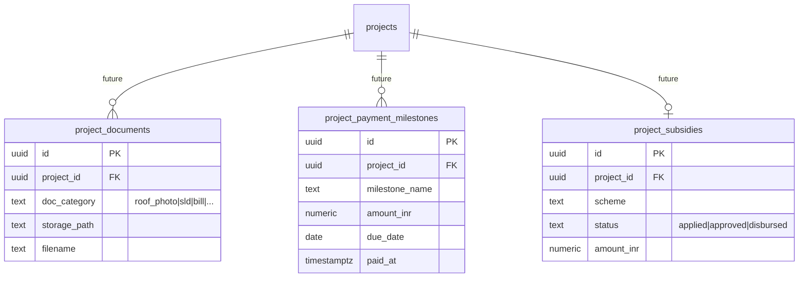

# Phase 3A — Database Entity-Relationship Diagram

**Status:** Frozen (migrations 036–045 deployed)  
**Last updated:** 1 June 2026  
**Parent doc:** [Complete Architecture](./phase-3a-complete-architecture.md)

---

## 1. Overview

Phase 3A extends the legacy `projects` pipeline table with operational columns and adds seven new tables for surveys, designs, tasks, activity, comments, team profiles, and notifications.

All new tables include `organization_id` for multi-tenant isolation. Foreign keys to `installer_profiles` use `ON DELETE SET NULL` to preserve audit history.

---

## 2. Full ERD (Phase 3A scope)



---

## 3. Relationship summary

| From | To | Cardinality | On delete |
|------|-----|-------------|-----------|
| `projects` | `organizations` | N:1 | CASCADE (via org) |
| `projects` | `leads` | N:0..1 | SET NULL |
| `projects` | `installer_profiles` (manager) | N:0..1 | SET NULL |
| `projects` | `installer_profiles` (tech) | N:0..1 | SET NULL |
| `project_site_surveys` | `projects` | 1:1 | CASCADE |
| `project_designs` | `projects` | N:1 | CASCADE |
| `project_tasks` | `projects` | N:1 | CASCADE |
| `project_activity_log` | `projects` | N:1 | CASCADE |
| `project_comments` | `projects` | N:1 | CASCADE |
| `project_comments` | `project_comments` | N:0..1 (thread) | SET NULL |
| `notifications` | `installer_profiles` | N:0..1 | SET NULL |

---

## 4. Key constraints & invariants

### 4.1 Projects

| Constraint | Detail |
|------------|--------|
| `projects_lead_id_key` | Unique index on `lead_id` (one project per lead when linked) |
| `projects_project_code_unique_idx` | Partial unique on `project_code WHERE NOT NULL` |
| Stage CHECK | `current_stage IN (survey, design, approval, installation, net_metering, completed)` |
| Status CHECK | `stage_status IN (not_started, in_progress, blocked, done)` |
| NM CHECK | `nm_substatus IN (6 values)` |

### 4.2 Surveys

| Constraint | Detail |
|------------|--------|
| `project_id UNIQUE` | Exactly one survey row per project |

### 4.3 Designs

| Constraint | Detail |
|------------|--------|
| `(project_id, version_number) UNIQUE` | Monotonic versioning |
| Partial unique on `(project_id) WHERE is_current` | At most one current version |

**Application transaction for new version:**
```sql
BEGIN;
UPDATE project_designs SET is_current = false WHERE project_id = ? AND is_current = true;
INSERT INTO project_designs (..., is_current = true) VALUES (...);
COMMIT;
```

### 4.4 Tasks

| Constraint | Detail |
|------------|--------|
| Stage CHECK | Includes `general` in addition to project stages |
| Status CHECK | `pending | in_progress | done | skipped | na` |

### 4.5 Notifications

| Constraint | Detail |
|------------|--------|
| `notifications_entity_pair_check` | `related_entity_type` and `related_entity_id` both NULL or both set |
| Type CHECK | 11 notification types |

---

## 5. Indexes (performance-critical)

| Index | Table | Purpose |
|-------|-------|---------|
| `projects_current_stage_idx` | projects | List filter by stage (active only) |
| `projects_dashboard_visible_idx` | projects | Active dashboard view |
| `project_activity_log_project_time_idx` | activity | Timeline DESC |
| `project_tasks_project_stage_idx` | tasks | Stage-filtered task list |
| `project_designs_one_current_per_project_idx` | designs | Current version lookup |
| `project_comments_project_time_idx` | comments | Comment feed |
| `notifications_recipient_unread_idx` | notifications | Unread badge |

---

## 6. Activity event types

`project_activity_log.event_type` is **not** CHECK-constrained (extensible without migration).

| event_type | metadata_json keys |
|------------|-------------------|
| `project_created` | — |
| `stage_changed` | `from_stage`, `to_stage`, `from_status`, `to_status` |
| `nm_substatus_changed` | `from_substatus`, `to_substatus` |
| `survey_submitted` | `survey_date`, `surveyed_by` |
| `design_created` / `design_revised` | `version_number`, `version_label`, `design_id` |
| `task_completed` | `task_title`, `stage` |
| `comment_added` | — |
| `project_archived` | — |
| `payment_recorded` | `milestone_name`, `amount_inr`, ... (future) |
| `document_uploaded` | `doc_category`, `doc_name`, `stage` (future) |
| `team_assigned` | `role_type`, `assignee_name` (future) |

---

## 7. Planned tables (future — not in database yet)

These are referenced in migration comments and architecture placeholders:



---

## 8. RLS policy summary (Phase 3)

All Phase 3A tables use **service-role full access** policies (`USING (true) WITH CHECK (true)`). This supports the current anon/service-key API pattern.

**Phase 5 plan:** Replace with JWT-scoped policies filtering by `organization_id` and `installer_profiles.user_id`.

Legacy `projects` table retains anon read/insert/update policies from migration 004 for backward compatibility.

---

## 9. Adaptive schema notes

Some production deployments have extended legacy columns on `projects` (e.g. `customer_name NOT NULL`, `solar_kw`). The application layer in `lib/project-store.ts` uses adaptive insert/update helpers to populate both legacy and Phase 3 column names without requiring schema normalization migrations.
