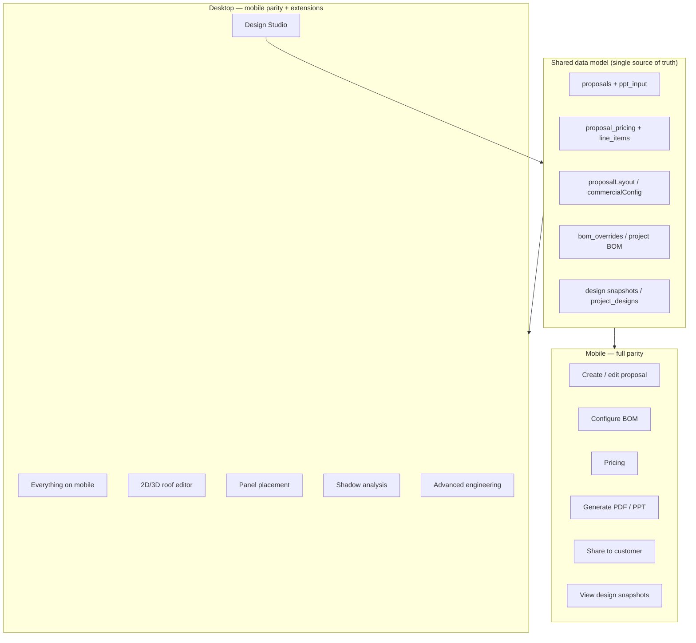
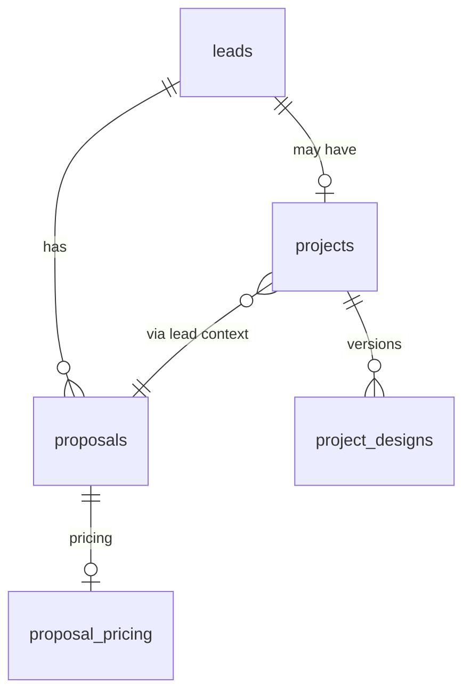

# Proposal Workspace & BOM — Mobile / Desktop Architecture

**Status:** Approved future requirement (architecture only — not yet a delivery phase)  
**Last updated:** 1 June 2026  
**Applies to:** Proposal OS, BOM builder, Design Studio, Project Hub links  
**Related:** [Commercial proposal engine](./commercial-proposal-engine.md) · [Phase 3A Hub](./phase-3a-4-project-hub.md) · [MASTERPLAN.md](../../MASTERPLAN.md)

---

## 1. Executive summary

**Proposal Workspace** and **BOM Builder** are one product surface with a **shared data model**. They must remain **fully functional on mobile and desktop**.

Design Studio is **not** a separate product. It is a **desktop-first extension** of the same Proposal Workspace, operating on the same proposal, pricing, layout, and design snapshot records.

**Never assume proposal creation or BOM editing is desktop-only.**

---

## 2. Platform principle

| Rule | Statement |
|------|-----------|
| **One model** | Proposal + BOM + pricing + layout + design versions use the same APIs and tables on all devices |
| **One workspace** | `/proposal`, `/workspace/[id]`, `/proposals/[id]` are views over the same deal — not forked apps |
| **Extension, not fork** | Design Studio reads/writes the same proposal/design records; it does not introduce a parallel schema |
| **Mobile-first delivery** | Any new proposal feature must ship mobile-usable before or with desktop-only tooling |
| **Progressive enhancement** | Desktop adds spatial/engineering UI; mobile gets simplified but **complete** workflows |

---

## 3. Capability matrix

### 3.1 Mobile — required (full parity)

| Capability | User outcome | Architectural constraint |
|------------|--------------|---------------------------|
| **Create proposal** | Start from lead/customer, presets, capacity | `POST /api/proposals`, `/proposal` builder must work at 360–412px width |
| **Edit proposal** | Change customer, system size, connection, modules | Same `PATCH` / extras payload paths as desktop; no mobile-only draft table |
| **Configure BOM** | Line items, brands, quantities, overrides | BOM from `proposal_pricing` + `projects.bom_overrides`; UI at `/proposals/[id]#bom` or embedded panel |
| **Change pricing** | Residential/commercial config, totals | `proposal_pricing`, `commercialConfig`, rate cards — persisted server-side |
| **Generate PDF** | Customer-ready output | Same generate pipeline (`/api/proposals/[id]/ppt`, web renderer, PDF export) |
| **Send to customer** | Share link / WhatsApp | Public `/proposal/[id]` + share tokens; no desktop-only share flow |
| **View design snapshots** | Read-only versions from hub or proposal | `GET` project designs / proposal-linked snapshots; mobile layout, not “open on desktop” |

### 3.2 Desktop — additional (extensions)

| Capability | Relationship to workspace |
|------------|---------------------------|
| **Full Design Studio** | Extended mode of `/workspace/[id]` or proposal builder — same `proposal.id` / `lead_id` context |
| **2D/3D roof editor** | Spatial editor component; outputs feed design snapshot / roof analysis fields |
| **Panel placement** | Writes into design/BOM-related structures (layout JSON, `ai_panel_layout`, or `project_designs`) |
| **Shadow analysis** | Engineering module; results stored in survey/design metadata already modeled |
| **Advanced engineering** | Optional tools (stringing, yield detail, DISCOM-specific checks) — gated UI, not gated data |

Desktop-only UI is allowed. Desktop-only **data paths** are not.

---

## 4. Route & surface map

| Route | Role | Mobile | Desktop |
|-------|------|--------|---------|
| `/proposal` | Primary proposal builder (create/edit) | **Required** | **Required** |
| `/workspace/[id]` | Deal workspace (proposal + design shell) | Core flows | + Design Studio |
| `/proposals` | Hub / list | Navigate + open | Full analytics |
| `/proposals/[id]` | Saved proposal detail, BOM, present | BOM + share | Full layout |
| `/proposal/[id]` (public) | Customer view | N/A (responsive) | N/A |
| `/projects/[id]?tab=design` | Project design versions (read v1) | View snapshots + link to proposal | Same + Studio deep link |

**Project Hub** links out to proposal/BOM (`/proposal?leadId=…`, `#bom`) — it does not duplicate proposal editing in the hub long term.

---

## 5. Shared data model

All surfaces must read/write these stores (no duplicate “mobile proposal” table):

| Store | Purpose |
|-------|---------|
| `proposals` | Core proposal row, `ppt_input`, status, `lead_id`, `organization_id` |
| `proposal_pricing` + line items | Canonical commercial numbers |
| `proposal_layout` / `ppt_input.commercialConfig` | Section visibility and commercial parameters |
| `projects.bom_overrides` | Project-level BOM deltas merged at render time |
| `project_designs` | Versioned design snapshots (Hub + Studio) |
| `project_site_surveys` | Site data feeding sizing (Studio reads, mobile can PATCH via API) |

**Sync rule:** Saving in Proposal Workspace invalidates the same SWR/cache keys whether the user is on phone or desktop (`/api/proposals/[id]`, pricing, layout, project detail).

---

## 6. Design Studio as extension

Design Studio is an **extension layer** on Proposal Workspace:

1. **Entry** — From proposal workspace or project hub with `proposalId` / `leadId` / `projectId` in context (`ShellContext.activeWorkspace`).
2. **Context bar** — Shows same deal identity as proposal builder (customer, kW, stage).
3. **Persistence** — Studio actions POST/PATCH the same APIs (design versions, survey fields, layout/BOM-related JSON) — not a separate export step.
4. **Mobile fallback** — When Studio is unavailable on small screens, user still configures BOM/pricing/generates PDF from `/proposal` or `/proposals/[id]`; Studio is additive.

**Anti-patterns (forbidden):**

- Separate “Studio proposals” table
- Mobile message: “Create proposal on desktop”
- BOM edits that only persist in local Studio state
- PDF generation that requires Studio completion

---

## 7. UX & engineering requirements

### 7.1 Mobile UX

- Touch targets ≥ 28px; collapsible sections (accordions) over wide forms
- Sticky primary actions: Save, Generate, Share
- BOM as scrollable line-item list with inline edit — not canvas-only
- PDF/share via same server endpoints (no client-only desktop export)
- Offline: optional PWA cache of **read** state only; writes require network with clear retry

### 7.2 Desktop UX

- Multi-column builder (list + preview) per existing Proposal Hub pattern
- Design Studio uses remaining viewport (canvas + tool rail)
- Keyboard shortcuts optional; not required for mobile parity

### 7.3 API & auth

- Same REST routes for all clients (`/api/proposals/*`, `/api/projects/[id]/designs`, `/api/projects/[id]/bom`)
- Phase 5 JWT RBAC applies uniformly — mobile roles must include proposal create/edit, not view-only by default

### 7.4 Testing

- Playwright (or equivalent) smoke tests at **390×844** for: create proposal → edit BOM → save → open public link
- Regression suite at **1366×900** for Studio and builder side-by-side
- No release gate that passes desktop-only proposal flows

---

## 8. Relationship to Phase 3A (Project Hub)

| Hub behavior today | Future alignment |
|--------------------|------------------|
| Design tab read-only v1 | Shows `project_designs`; links to **Proposal Workspace** for edit, not in-hub editor |
| “Open proposal” / BOM links | Remain entry points into shared proposal/BOM surfaces |
| No in-hub PDF generation | PDF/share stays in Proposal Workspace |

Phase 3A-5+ hub work must **deep-link** into mobile-capable proposal routes, not reimplement BOM.

---

## 9. Phasing guidance (suggested)

| Phase | Focus |
|-------|--------|
| **Now (documented)** | Lock architecture principles; audit mobile gaps in `/proposal` and `/proposals/[id]#bom` |
| **Next** | Mobile BOM panel parity, collapsible commercial builder, share/PDF verification on 390px |
| **Then** | Design Studio v1 on desktop writing `project_designs` + layout JSON |
| **Later** | 2D/3D roof, panel placement, shadow — still same data model |

---

## 10. Sign-off checklist

Before any phase ships proposal or BOM features, verify:

- [ ] Feature works on 390px width without horizontal scroll
- [ ] Data persists via existing APIs (no mobile-only store)
- [ ] Desktop Studio (if any) uses same IDs and invalidates shared caches
- [ ] QA script includes mobile create → BOM → generate/share path
- [ ] Product copy never states “desktop only” for core sales workflows

---

## 11. References (codebase)

| Area | Primary paths |
|------|----------------|
| Proposal builder | `app/(main)/proposal/page.tsx` |
| Deal workspace | `app/(main)/workspace/[id]/page.tsx` |
| Proposals hub | `app/(main)/proposals/page.tsx` |
| BOM API | `app/api/projects/[id]/bom/route.ts` |
| Proposal APIs | `app/api/proposals/[id]/*` |
| Commercial config | `lib/commercial-proposal-config.ts`, `docs/architecture/commercial-proposal-engine.md` |
| PPT / PDF render | `lib/proposal-ppt.ts`, `components/proposal/web-renderer.tsx` |
